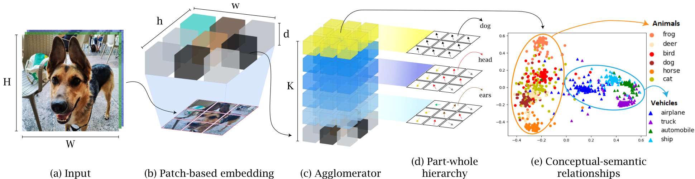
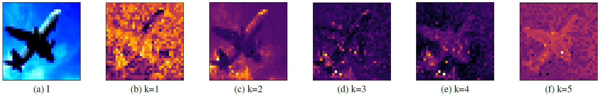

# Agglomerator 🧠🗜
Official code for "Interpretable part-whole hierarchies and conceptual-semantic relationships in neural networks" ([N. Garau](https://scholar.google.it/citations?user=r8BzAfcAAAAJ&hl=en), [N. Bisagno](https://scholar.google.it/citations?user=ZpDDp2AAAAAJ&hl=en), [Z. Sambugaro](https://scholar.google.it/citations?user=a4CmqMYAAAAJ&hl=en), [N. Conci](https://scholar.google.it/citations?user=mR1GK28AAAAJ&hl=en) (Accepted for CVPR'22) \[[pdf](https://arxiv.org/abs/2203.03282)\]

## Setup

From the main directory run:

``pipenv install``

to install all the required dependencies.

## Training/validation/testing

The code comes with [separate configuration files](config) for each dataset, with multiple flags to run training, validation and testing.

As an example, to run contrastive pre-training on CIFAR-10 on a single GPU, execute:

``CUDA_VISIBLE_DEVICES=0 python src/main.py --flagfile config/config_CIFAR10.cfg``

After running the pre-training you can run the training phase with:

``CUDA_VISIBLE_DEVICES=0 python src/main.py --flagfile config/config_CIFAR10.cfg --resume_training --supervise --load_checkpoint_dir <path_to_checkpoint.ckpt>``

To run testing or to freeze the network weights, set the 'mode' flag (e.g. ``--mode test`` or ``--mode freeze``). 
Refer to [this page](src/flags_Agglomerator.py) for additional info about each flag.

## Pre-trained models

We provide [pre-trained models](https://drive.google.com/drive/folders/1fydLRfoyZVsKKZYgKHrjh2lfstLWGbh1?usp=sharing) that can be used to plot islands of agreement or fine-tune for image classification. To fine-tune a pretrained model, just run:

``CUDA_VISIBLE_DEVICES=0 python src/main.py --flagfile config/config_CIFAR10.cfg --patch_size 1 --patch_dim 128 --resume_training --supervise --load_checkpoint_dir path_to_pretrained_model.ckpt``

## Plotting islands of agreement

To enable live visualization of the islands of the agreement during training/val/test, set the flag ``--plot_islands``.

## Citing

    @inproceedings{garau2022interpretable,
      title={Interpretable part-whole hierarchies and conceptual-semantic relationships in neural networks},
      author={Garau, Nicola and Bisagno, Niccol{\`o} and Sambugaro, Zeno and Conci, Nicola},
      booktitle={Proceedings of the IEEE/CVF Conference on Computer Vision and Pattern Recognition},
      pages={13689--13698},
      year={2022}
    }

## Credits

- Theoretical idea by [Geoffrey Hinton](https://arxiv.org/pdf/2102.12627.pdf)
- Base GLOM network structure inspired by [lucidrains implementation](https://github.com/lucidrains/glom-pytorch)
- Convolutional tokenizer inspired by [isaaccorley ConvMLP implementation](https://github.com/isaaccorley/convmlp-pytorch)
- Various implementation ideas inspired by [Yannic Kilcher's GLOM explanation](https://www.youtube.com/watch?v=cllFzkvrYmE)
